# Deterministic Task Execution Protocol — UML Diagrams

---

## 1. As-Is vs To-Be: タスク完了までのシーケンス比較

### As-Is（現状: LLM の自己申告ベース）

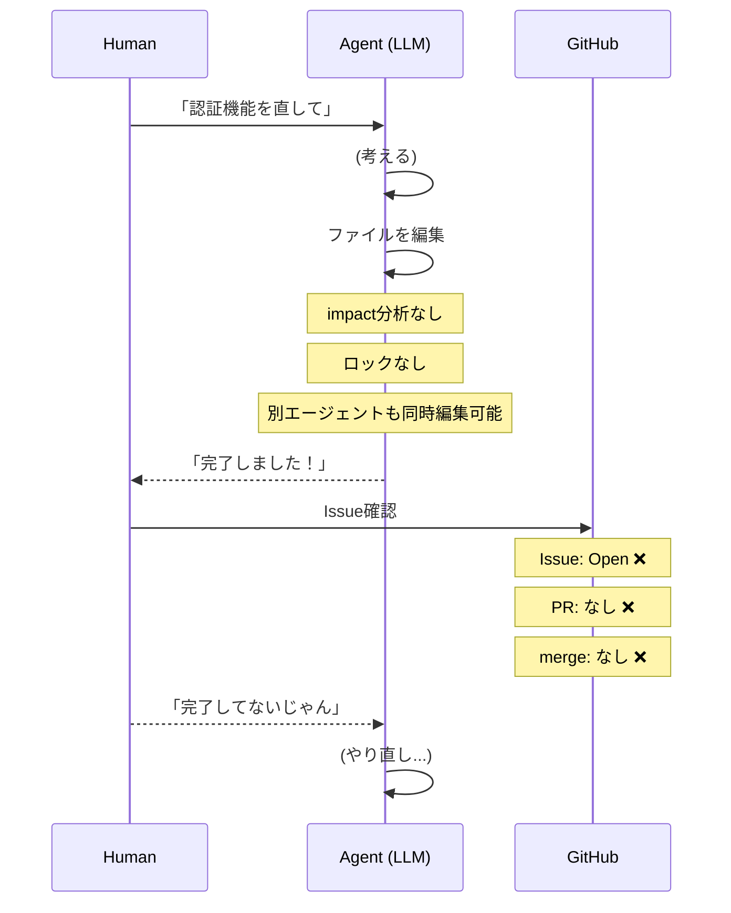

### To-Be（実装後: GATE による確定的制御）

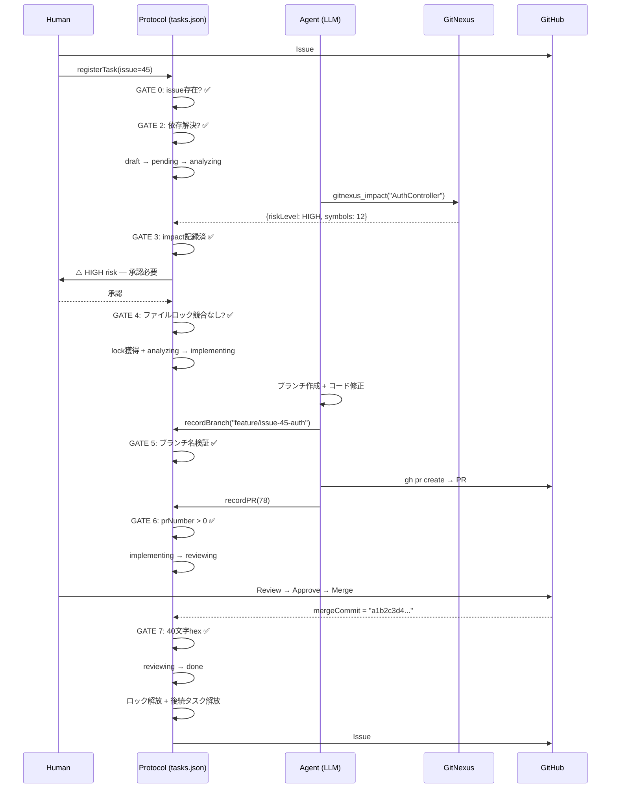

---

## 2. ステートマシン: 既存 vs 拡張

### As-Is（既存: 条件チェックなし）

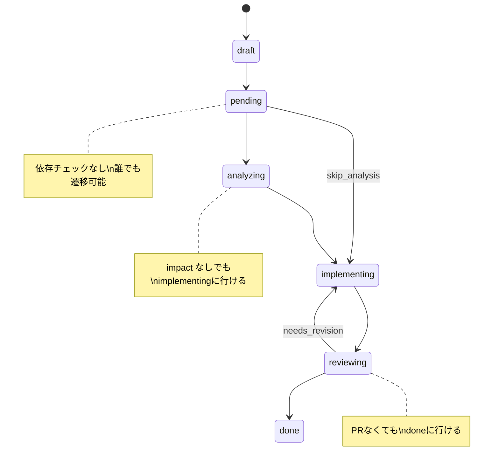

### To-Be（拡張: 全遷移に GATE）

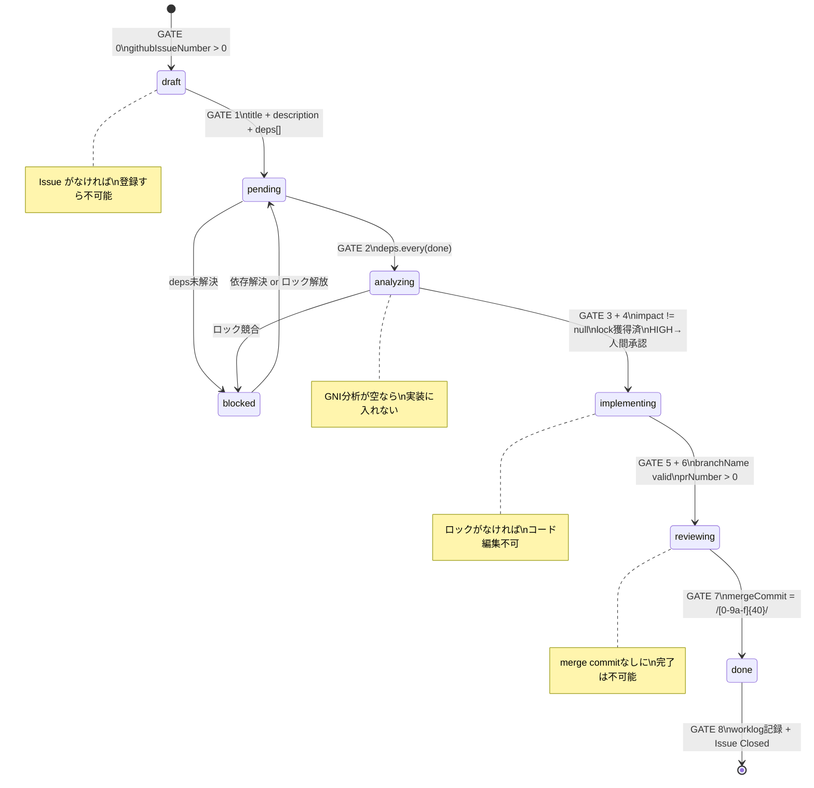

---

## 3. ファイルロック: 競合防止の仕組み

### As-Is（ロックなし）

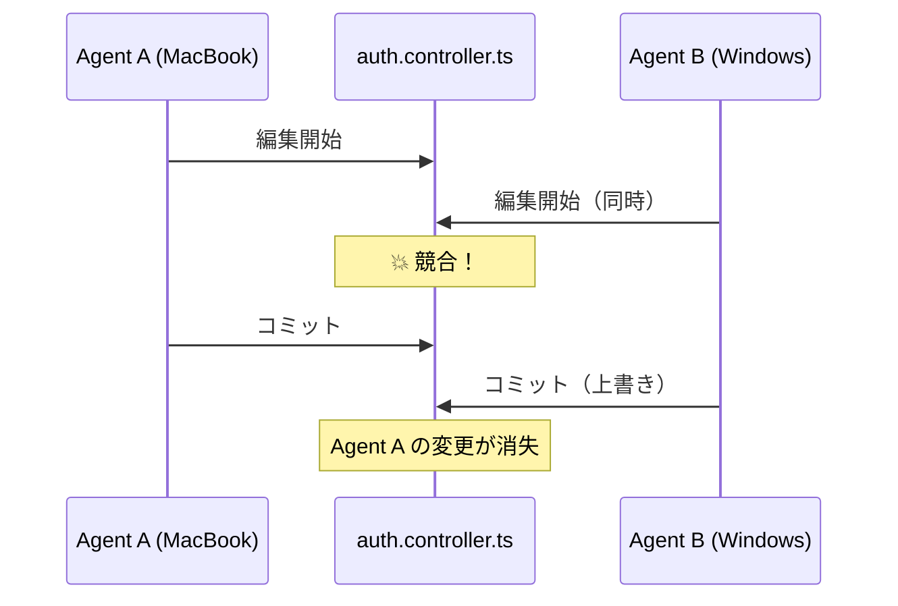

### To-Be（ファイルロック付き）

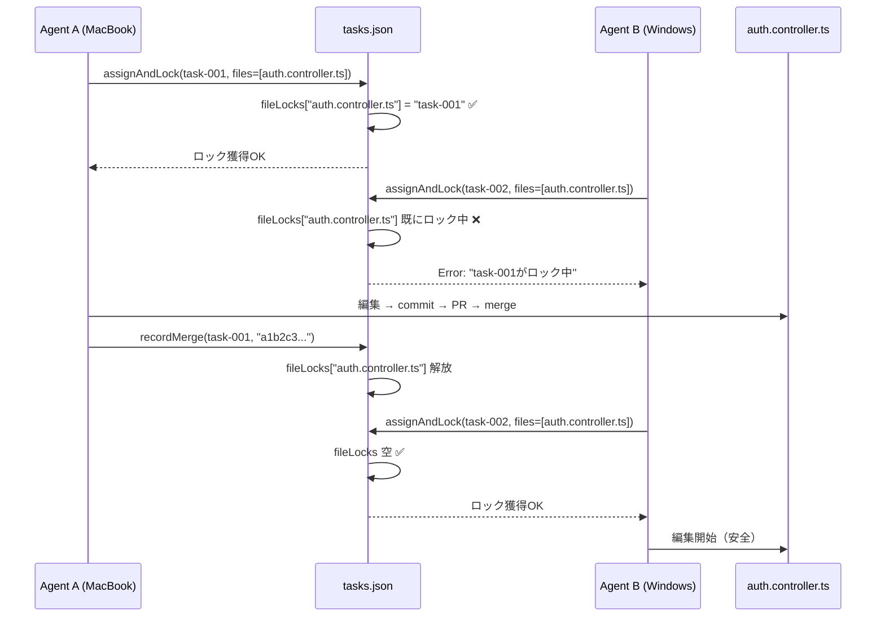

---

## 4. DAG 依存関係: 実行順序の強制

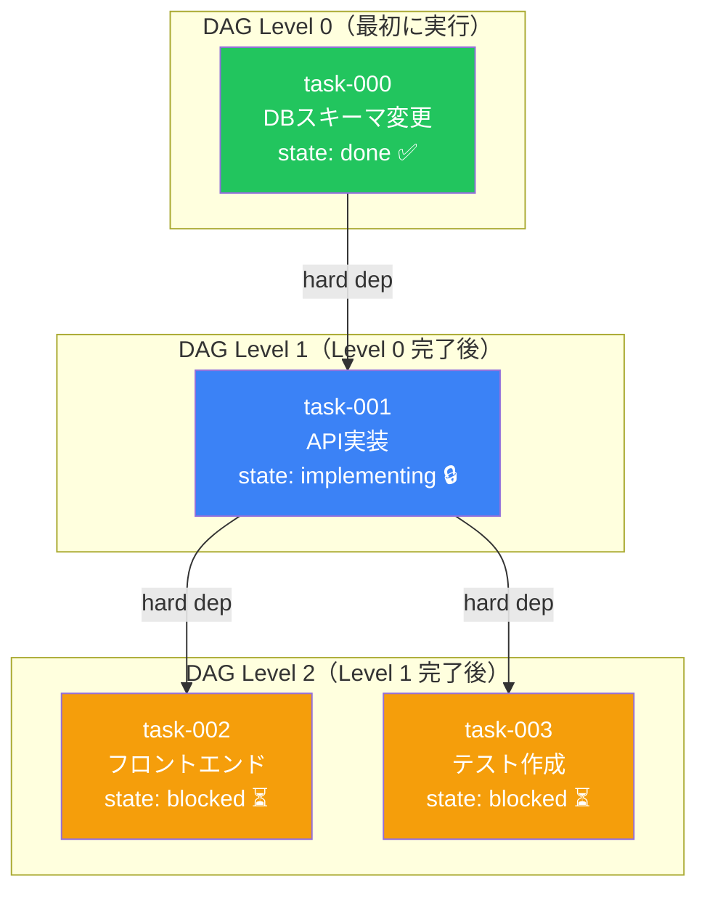

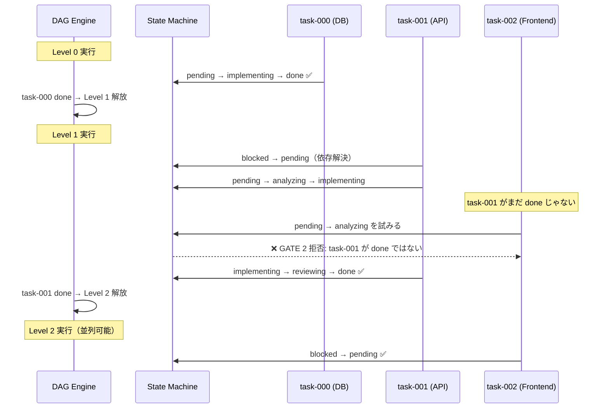

---

## 5. 全体アーキテクチャ: 3ピース統合

### As-Is（分散・未接続）

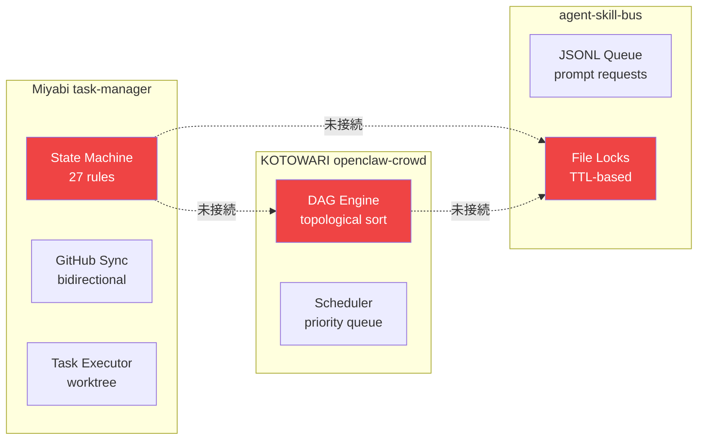

### To-Be（統合: DeterministicExecutionProtocol）

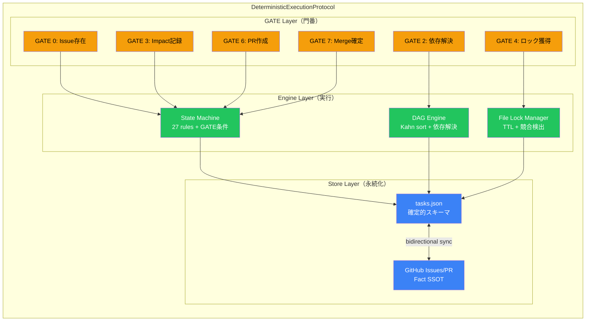

---

## 6. マルチマシン協調: Before / After

### As-Is

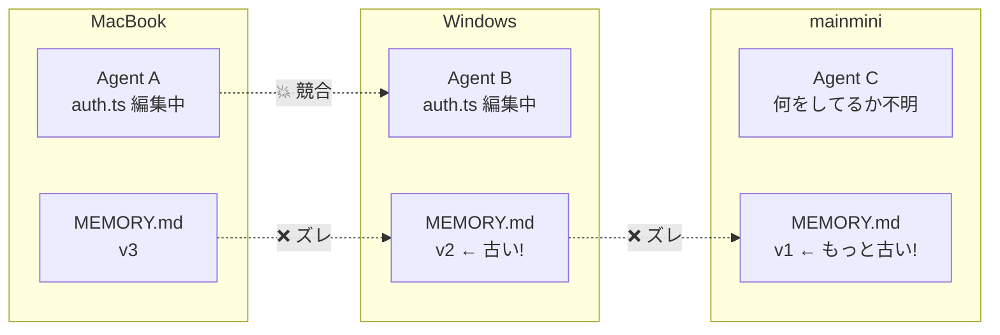

### To-Be

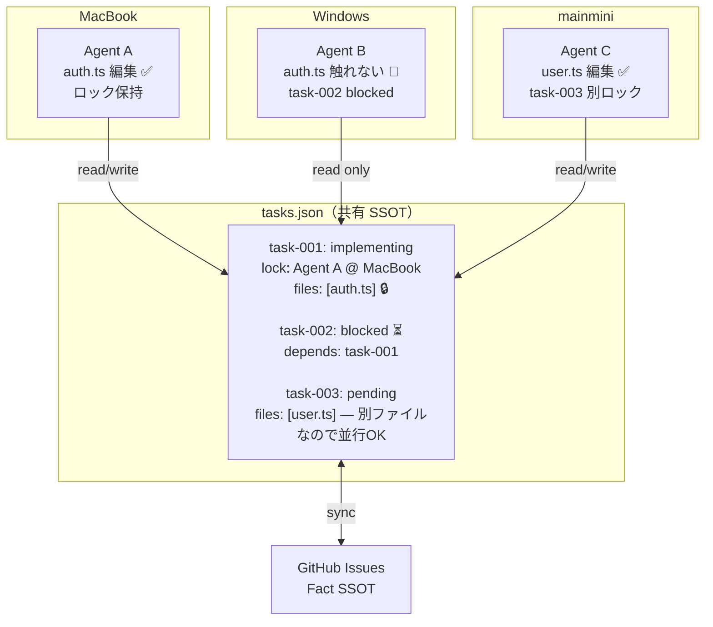

---

## 7. GATE チェーン: 1タスクの完全ライフサイクル

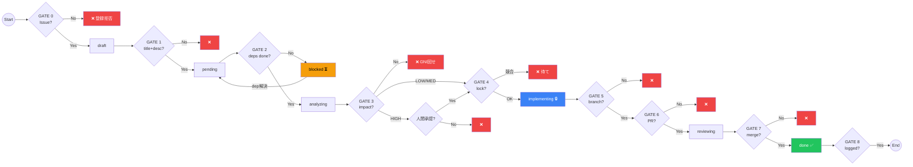

---

_Generated: 2026-04-10 | Deterministic Task Execution Protocol UML_
